# go-home
go-home is a demo application leveraging the Tetration Kafka interface and the OpenAPI to identify a security threat (Meltdown in this example) and take an action on this threat (in this case isolate the host to contain infection).

## Setup
### Alert Source
In order to use go-home, you need to configure alerting in Tetration. First step is to enable alerts in the data platform.
To do so, navigate to data platform and choose Tetration apps:

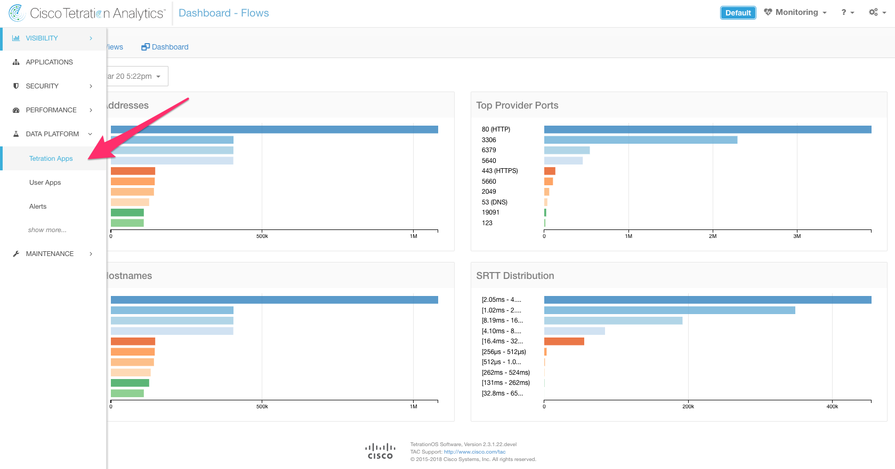

In Tetration Apps navigate to app store in order to create a new app:

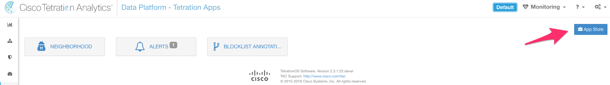

Choose "Alerts" and click on `Create an Instance`:

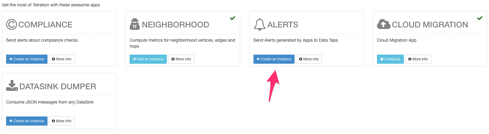

This will bring you to the summary of any instance already existing, if no instance exist you will be able to create one on the top right `Add New Instance`:

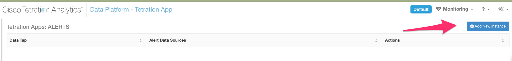

We can now configure the alert source.

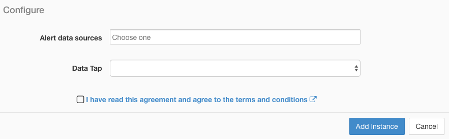

Alert source will auto-populate on click. Select `Rule Engine`

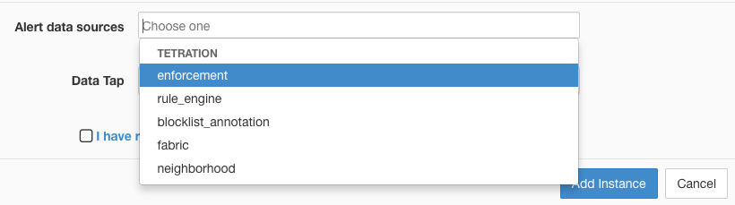

And now select `Alerts` in the Data Tap drop down

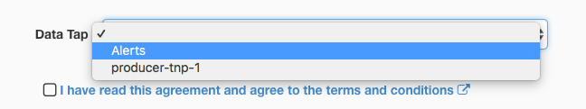

Read and accept the agreement and click on `Add Instance`.

Your alert is now configured.

### Getting Kafka Parameters
Tetration leverages secure Kafka for messaging, in order to connect you will need certificate files and also broker IPs. This is provided under the form of a package downloadable via the web interface.

To download the package go to `Data Platform Admin`. Note: in order to access this page, the user needs to have Site Admin privileges.

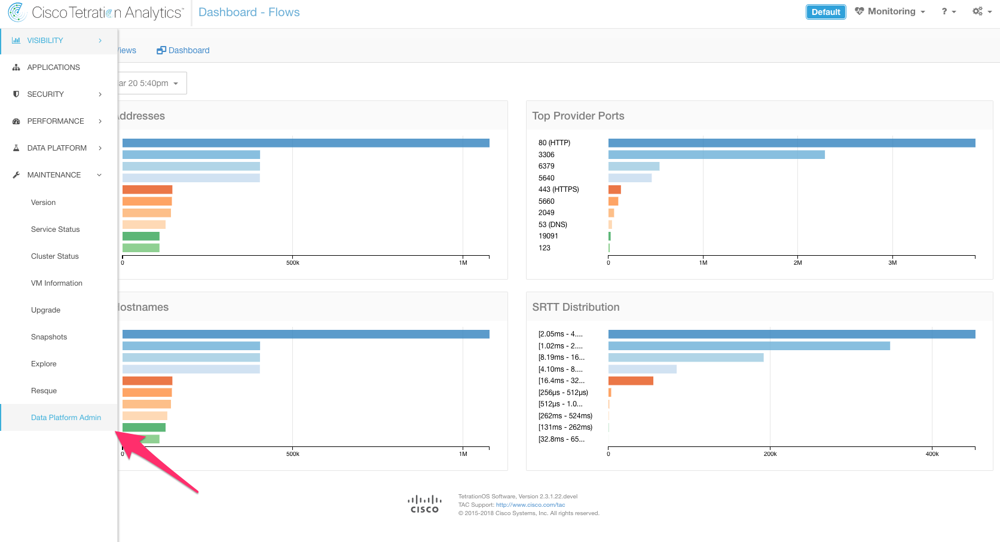

Navigate to Data Taps

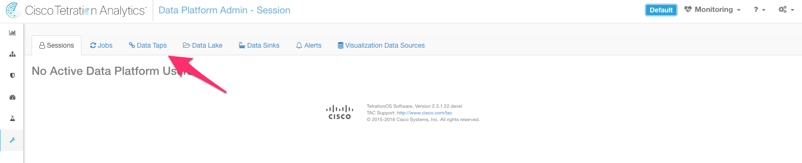

Select the `Alerts` Data Tap and click on the download button on the right side.

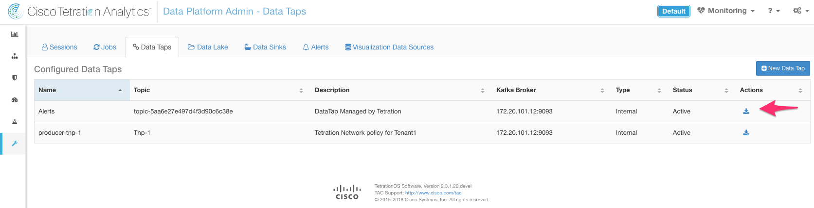

A window will proposed 2 format of certificates `Java KeyStore` and `Certificate`. Select `Certificate`

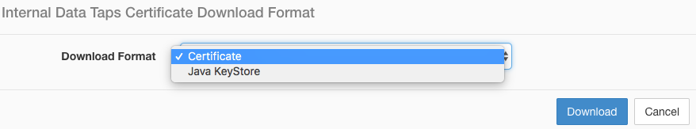

Click Download to start the download process. This should download a tar.gz file containing the following files:

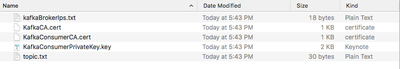

* `kafkaBrokersIps.txt` - IP address of the brokers including the port.
* `KafkaCA.cert` - Root CA cert
* `KafkaConsumerCA.cert`- Client Certificate
* `KafkaConsumerPrivateKey.key` - Client Key
* `topic.txt` - Topic Name

### Configuration file

In order to start go-home you need a configuration file located in the conf directory (same folder as the binary).

There parameters are self explanatory.
```
[openapi]
endpoint = "https://myhost"
key = "mykey"
secret = "mysecret"
# Shall we check the certificate
verify = false
# Do we want to isolate?
enabled = false

[kafka]
topic = "mytopic"
ssl = true
rootca = "cert/KafkaCA.cert"
cert = "cert/KafkaConsumerCA.cert"
key = "cert/KafkaConsumerPrivateKey.key"
brokers = ["1.1.1.1:9093"]

[twilio]
# Do we want to send SMS or not?
enabled = false
# Token from Twilio
token = ""
# SID from Twilio
sid = ""
# Phone number, international format with no space, for example +123456789
to = ""
# Maximum messages per minute
limit = 1
```

This will configure a basic setup to integrate go-home with Tetration. From there you need to:
* Configure a Forensics Alert - [doc](documentation/forensics.md)
* Configure an Isolation Rule - [doc](documentation/isolation.md)

## Run
```
go build
./go-home -logtostderr=true -v1
```
